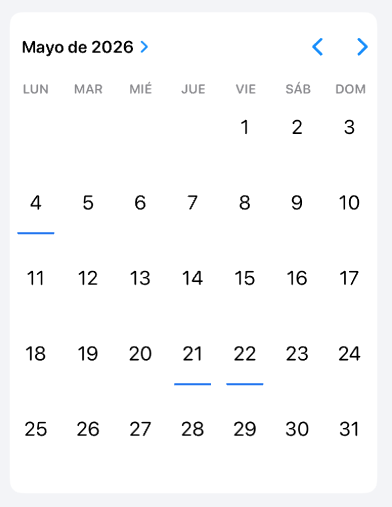

# DHLCustomCalendarView
Delegable to select an item/items from a list.


## Preview


## Installation

### CocoaPods

```ruby
pod 'DHLCustomCalendarView'
```

## Quick Start

### UIKit

```swift
// para seleccionar solo una fecha
calendarView.setUp(
    selectedDateAction: { date in
            
    }
)
        
// para seleccionar varias fechas
calendarView.setUp(
    selectedDatesAction: { dates in
            
    }
)

calendarView.setUpDecorations(getCalendarDecorations())

func getCalendarDecorations() -> [Date?: UICalendarView.Decoration] {
        
    var decorations: [Date?: UICalendarView.Decoration] = [:]
    
    // imagen
    let decoration: UICalendarView.Decoration = .image(R.image.decoration()!)
                
    // icono default redondo
    let decoration2: UICalendarView.Decoration = .default(color: .blue, size: .medium)
                
    // vista custom
    let decoration3: UICalendarView.Decoration = .customView( {
        let view = DHLCustomDecorationView(width: self.calendarContainerView.width/10)
        view.backgroundColor = .clear
                    
        view.addCustomSubview(color: R.color.blue_app()!, bottomSpacing: 14)
                    
        return view
    })
    
    decorations[Date()] = decoration
}
```
